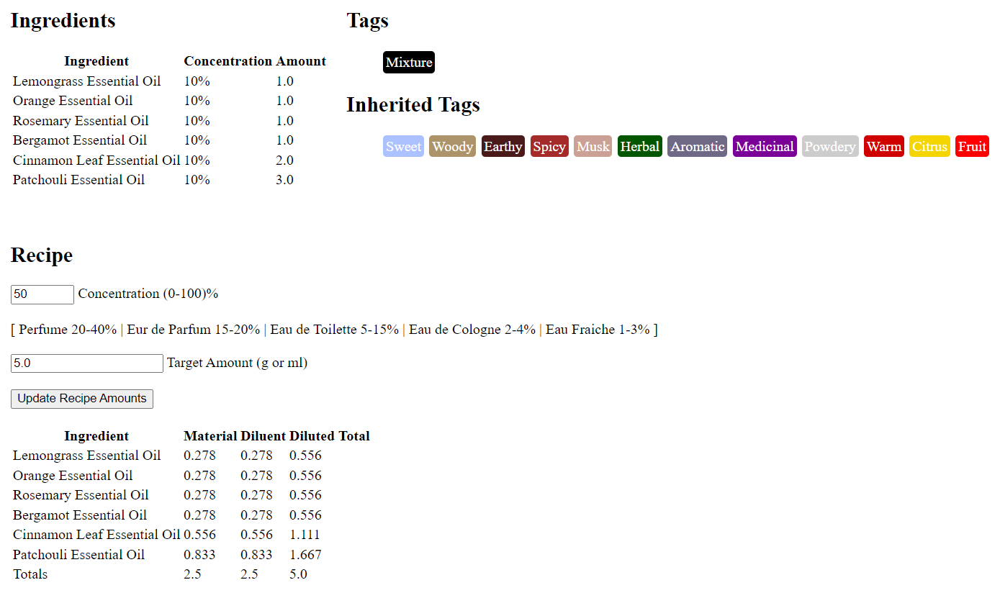
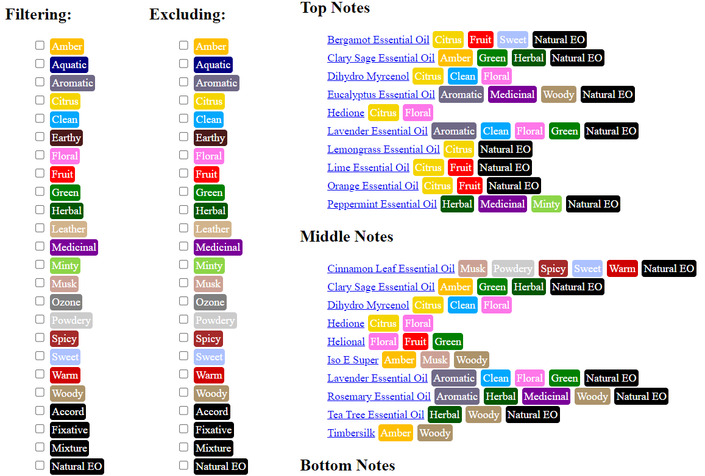

    

Ascent is a Django project I use to track my collection of oils, scents, materials, and recipes.

## Install

This project relies on Python and Django. If you do not have those, install them first.

Clone this project and enter the project root directory then run:

```bash
python manage.py runserver
```

For now the sqlite3 db file is included in this repository so my data can move with the code. If others find this project useful then we will have to offload the database elsewhere.

## Features

### Admin

As with any typical Django project, Ascent has an admin section to edit materials, ingredients, categories, and tags.

### Recipes

Ascent can store and calculate perfume recipes to provide different concentrations:

- Eau Fraiche
- Eau de Cologne
- Eau de Toilette
- Eau de Parfum
- Parfum



### Catalogue

Ascent categorizes materials and recipes based on the following concepts:

- Notes (woody, floral, sweet, citrus)
- Levels (top, middle, bottom)
- Special Properties (fixative, natural essential oil)
- Srouce (stores, online shop, a friend)

Users can explore this catalogue by filtering or excluding various tags:

